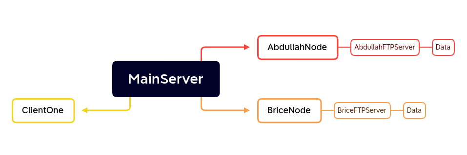

## Secured-Distributed-File-Sharing-System

A multi-threaded, secured file sharing system based on `python`.

### Python Packages
- Pyftpdlib
- rpyc
- pandas
- pycrypto

### Architecture

|  |
| -------- |
| 
 Figure: Project Architecture 
 |